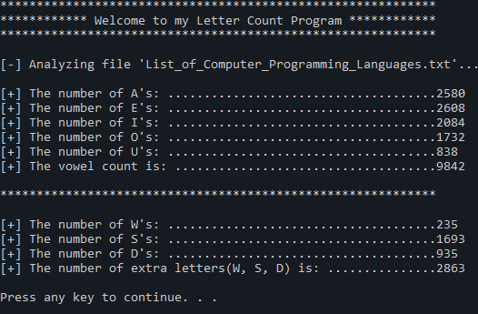

# Description

A simple program that you can run using the command line. It takes a file name as an argument and outputs the number of vowels in that file.

-   Given a file name the program does the following:
	-   Count the frequency of each vowel character in the file.
	-   Count the total number of vowels in the file.
	-   Extra: Count the frequency of W, S, D characters in the file.

